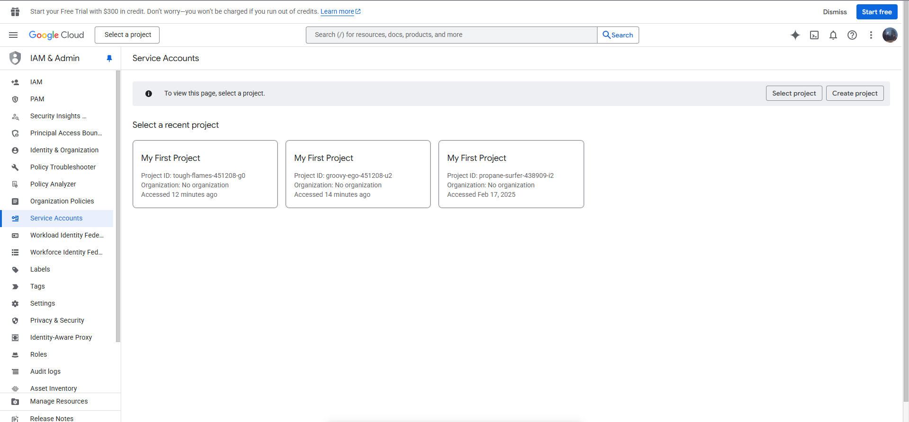
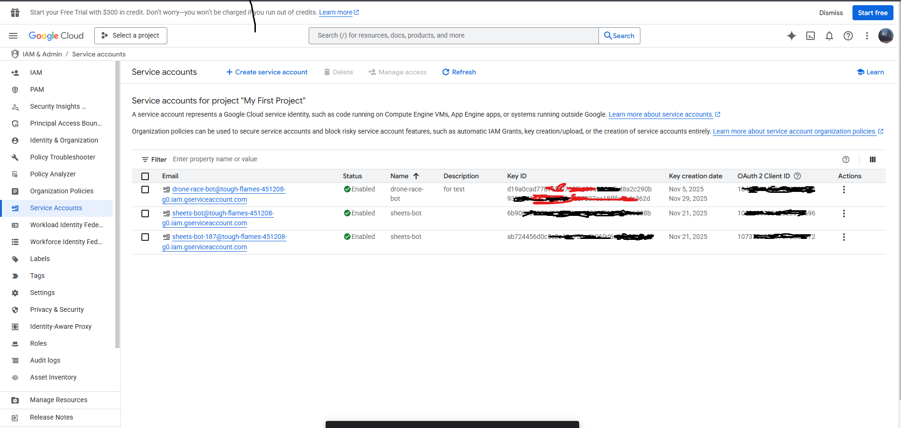
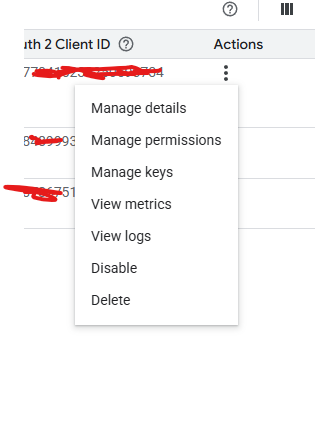
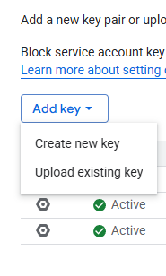
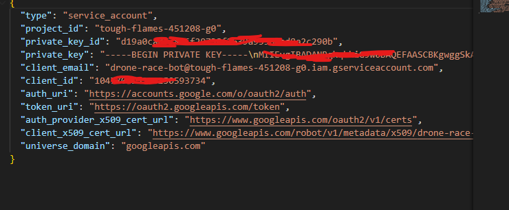
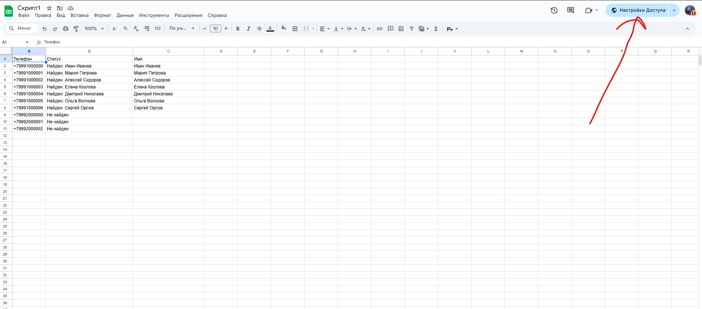
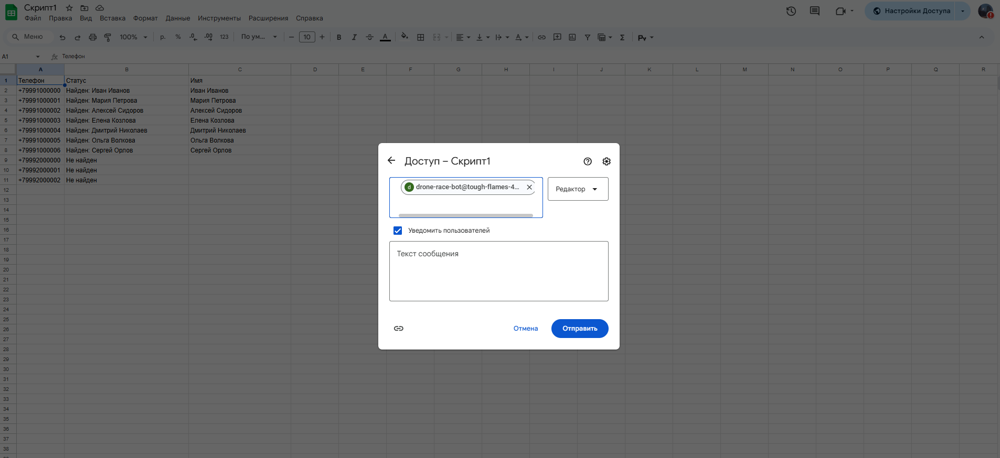
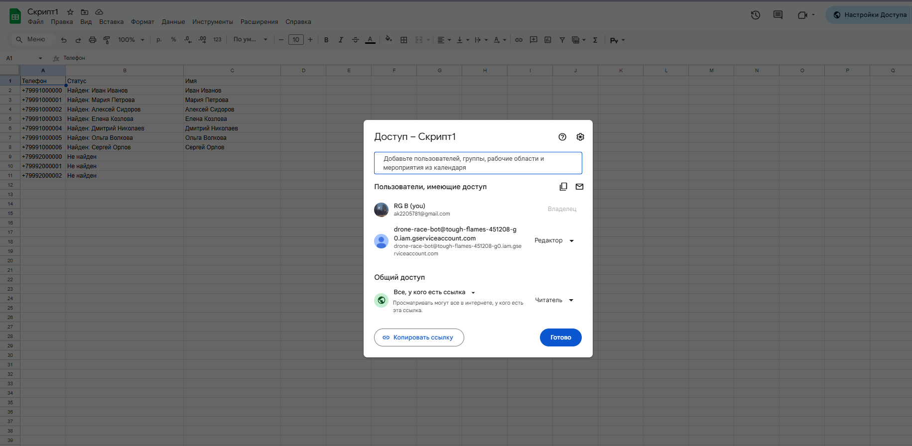

# 🟩 Как настроить доступ к Google Таблицам через сервисный аккаунт (5 минут)  
Полная инструкция для всех моих проектов:  

1. Переходим по ссылке и создаем сервисный новый проект
https://console.cloud.google.com/projectselector2/iam-admin/serviceaccounts?supportedpurview=project

### 🟩 ПРОЕКТЫ (Project ID) — где создаются сервисные аккаунты
Каждый проект Google Cloud — это отдельная «песочница» с собственными настройками, квотами и биллингом.

**Примеры реальных проектов (у тебя может быть любой):**
- Project ID: tough-flames-451208-g0
- Project ID: propane-surfer-438909-i2
- Project ID: groovy-ego-451208-u2
- Project ID: my-company-bot-2025

Ты можешь иметь сколько угодно проектов — хоть 100.

### Официальная ссылка для создания сервисного аккаунта
👉 https://console.cloud.google.com/iam-admin/serviceaccounts  
(100% безопасно — это официальная страница Google Cloud)

### Как создать сервисный аккаунт (по шагам, 5 минут):

1. Перейди по ссылке выше  
2. Выбери или создай проект (например, `my-finance-bot-2025`)  
3. Нажми **«Создать сервисный аккаунт»**  
4. Назови его, например:  
   → `sheets-bot`  
   → `automation-finance`  
   → `warehouse-bot`  
5. Права на первых двух шагах — просто **Продолжить** (не нужно ничего выбирать)  
6. После создания → зайди в аккаунт → вкладка **«Ключи»**  
7. **Добавить ключ → Создать новый ключ → JSON**  
8. Скачай файл `.json` → это и есть твой ключ для всех приложений  

После чего отправить ключ разработчику. 
Содержимое файла:

### Как дать доступ к своей Google Таблице:

1. Открой нужную таблицу  

2. Нажми **«Поделиться»** (зелёная кнопка сверху справа)  

3. Вставь email сервисного аккаунта (выглядит так):

4. Вставь email сервисного аккаунта (выглядит так):

### Поздравляю доступ получен

4. Выбери роль: **Редактор**  
5. Нажми «Отправить»  

Готово! Теперь все мои приложения смогут читать и писать в эту таблицу автоматически.

### Что ты видишь в списке сервисных аккаунтов — расшифровка

| Поле                     | Что это значит                                                                 |
|--------------------------|---------------------------------------------------------------------------------|
| **Email**                | `sheets-bot@project-id.iam.gserviceaccount.com` — «робот», который работает с таблицами |
| **Status: Enabled**      | Работает. Если Disabled — API не будет работать                                 |
| **Name**                 | Просто название для удобства (sheets-bot, warehouse-bot и т.д.)                 |
| **Key ID**               | Идентификатор ключа (не сам ключ!)                                              |
| **Key creation date**    | Когда был создан JSON-файл                                                      |
| **OAuth 2 Client ID**    | Нужно только для сложных авторизаций (нам не требуется)                        |

### Оптимальная структура (как делают все профи):

- Один Google Cloud проект
- └── Один сервисный аккаунт (например sheets-bot@my-company.iam.gserviceaccount.com)
- └── Доступ ко всем таблицам (финансы, склад, CRM, HR, продажи)

Один аккаунт → 100 таблиц = работает идеально  
Не нужно создавать отдельный бот под каждое приложение!

### Важные правила безопасности:

- JSON-файл = полный доступ к таблицам → никогда не выкладывай в GitHub и не отправляй по почте  
- Если ключ скомпрометирован → зайди в консоль и удали его  
- Квоты огромные: 60 запросов/минуту — ты никогда их не превысишь  
- Сервисный аккаунт НЕ может зайти в Gmail, YouTube и т.д. — только API  

Markdown✅ ПОЧЕМУ МОЖНО И НУЖНО ИМЕТЬ НЕСКОЛЬКО КЛЮЧЕЙ ДЛЯ ОДНОГО СЕРВИСНОГО АККАУНТА  
(Лучшие практики безопасности Google Cloud 2025)

1. **Для разных разработчиков / серверов**  
   Пример:  
   • Ключ №1 — на продакшн-сервере (Streamlit Cloud)  
   • Ключ №2 — у тебя на ноутбуке для локальной разработки  
   • Ключ №3 — у коллеги-аналитика  
   Так каждый работает независимо, и никто не «ломает» друг другу доступ.

2. **Для ротации ключей (обязательная security best practice)**  
   Google и все аудиторы требуют периодически менять ключи.  
   Как делать ротацию без остановки работы:  
   1. Создаёшь новый ключ  
   2. Переключаешь все приложения на него  
   3. Удаляешь старый  
   → Сервисный аккаунт остаётся тем же, приложение не падает.

3. **Чтобы быстро отключить утечку, не ломая всё остальное**  
   Случайно выложил ключ в GitHub?  
   → Заходишь в консоль → удаляешь только этот ключ  
   → Остальные ключи продолжают работать.  
   

4. **Для разных окружений**  
   Классическая схема:  
   • `key-dev.json` — локальная разработка  
   • `key-staging.json` — тестовая среда  
   • `key-prod.json` — боевой сервер  
   Один сервисный аккаунт — три ключа.

5. **Безопасная работа в команде**  
   Пришло 3 новых сотрудника?  
   → Каждому создаёшь свой ключ  
   → Кто-то уволился или ключ утёк — отключаешь только его  
   → Остальные продолжают работать

**Вывод:  
Нормально и правильно — иметь 2–4 активных ключа у одного сервисного аккаунта.  
Не нормально — 10–20 ключей (это уже бардак).

Держи максимум 3 ключа:  
- `prod-key.json` — основной боевой  
- `dev-key.json` — для локальной разработки  
- `backup-key.json` — на случай экстренной ротации
